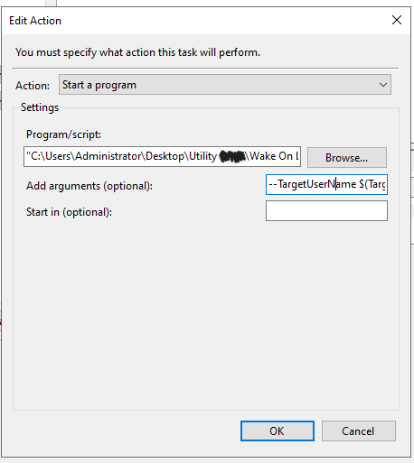

# Domain Wake-on-LAN via VPN Login

This project automates the process of waking up domain PCs when a user logs in to the VPN using their domain credentials.  
The idea was to avoid requiring users to install extra software or change their workflow. Instead, the Active Directory server listens for login events and triggers this script to wake up the corresponding PC.

## Why I built this
I wanted to make it seamless for users: when they connected to the VPN with their domain credentials, their assigned workstation would automatically power on.  
To achieve this, I:  
- Monitored **Windows Security Logs** for login events (Event ID `4624`).  
- Created a **Task Scheduler job** on the Active Directory server to trigger on those events.  
- Passed the username to this script, which looks up the corresponding PC and MAC address, then sends a **Wake-on-LAN magic packet**.  

## How it works
1. A login event occurs on the Active Directory Server.  
2. Windows Task Scheduler (configured with `event.xml` as a template) detects it and runs this script passing as an argument the username to the script. 
4. The script checks the `username_pc_dict` for the associated **PC name** and **MAC address**.  
5. It resolves the hostname to an IP, then sends a magic packet to wake the PC.  

## Files in this repo
- `wol.py` → The main script.  
- `event.xml` → Template for the Windows Task Scheduler trigger (listens for Event ID 4624).  
- `argument.txt` → Argument definition to pass the username from the event into the script.  

## Requirements
- VPN + Active Directory environment  
- Wake-on-LAN enabled in the BIOS and OS of target PCs  
- Firewall/antivirus rules allowing magic packets (default port `9`) from the AD server  

## Usage
1. Configure the `username_pc_dict` in the script with a list of usernames allowed to Wake on Lan in your domain specifying the name of the pc to wake up and its mac address:

   username_pc_dict = {  
       "username_1": ["PC_name_1", "00:1A:4B:8C:00:12"],  
       "username_2": ["PC_name_2", "00:1A:4B:8C:00:12"],  
   }  

   (Usernames are case-sensitive)

3. Make `wol.py` into an executable file.
4. Deploy `event.xml` in Task Scheduler on the Active Directory server.  
5. Link `argument.txt` so the Task Scheduler passes the login username to the script and make the scheduler run the `wol.exe` script like in the following example image.  
6. Test by logging in via VPN with a configured user account.  
